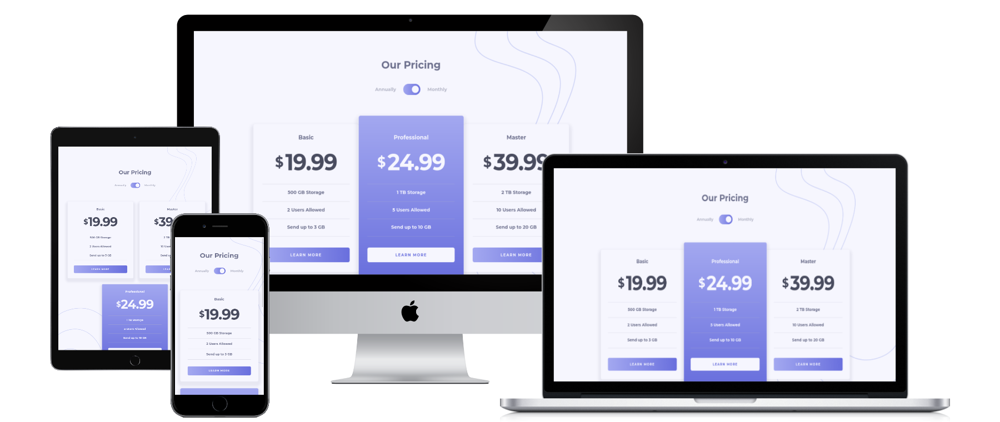

# Frontend Mentor - Pricing component with toggle solution

This is a solution to the [Pricing component with toggle challenge on Frontend Mentor](https://www.frontendmentor.io/challenges/pricing-component-with-toggle-8vPwRMIC). Frontend Mentor challenges help you improve your coding skills by building realistic projects. 

## Table of contents

- [Overview](#overview)
  - [The challenge](#the-challenge)
  - [Screenshot](#screenshot)
  - [Links](#links)
- [My process](#my-process)
  - [Built with](#built-with)
  - [What I learned](#what-i-learned)
  - [Continued development](#continued-development)
  - [Useful resources](#useful-resources)
- [Author](#author)

## Overview

### The challenge

Users should be able to:

- View the optimal layout for the component depending on their device's screen size
- Control the toggle with both their mouse/trackpad and their keyboard
- **Bonus**: Complete the challenge with just HTML and CSS

### Screenshot

### Links

- Solution URL: [Github](https://github.com/skyv26/pricing-component-with-toggle)
- Live Site URL: [Git Pages](https://skyv26.github.io/pricing-component-with-toggle/)

## My process

### Built with

- Semantic HTML5 markup
- CSS custom properties
- Flexbox
- CSS Grid
- Mobile-first workflow
- SASS

### What I learned

custom css for checkbox input, SASS, GRID Layout 

### Continued development

SASS, ReactJS, Redux

### Useful resources

- [YouTube Tutorial By DesignCourse](https://www.youtube.com/watch?v=NTyCpC7IrD8) - This helped me for making custom toggle btn

## Author

- LinkedIn - [@dev.aakashv](https://www.linkedin.com/in/devaakash/)
- Frontend Mentor - [@skyv26](https://www.frontendmentor.io/profile/skyv26)
- Twitter - [@vrma_aakash](https://www.twitter.com/vrma_aakash)